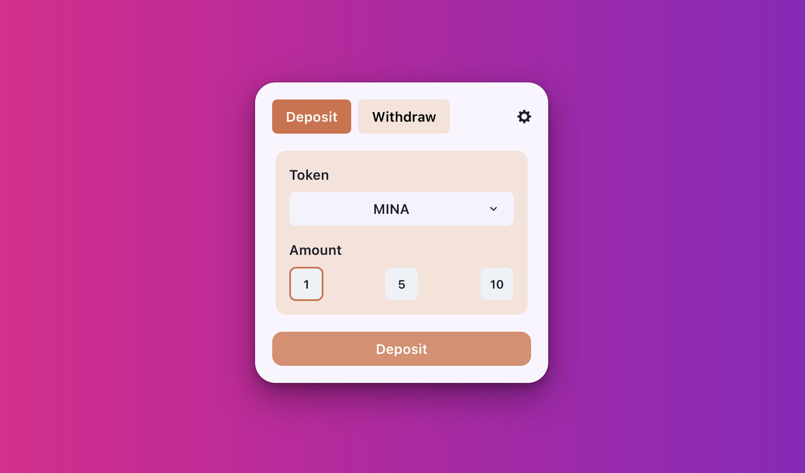
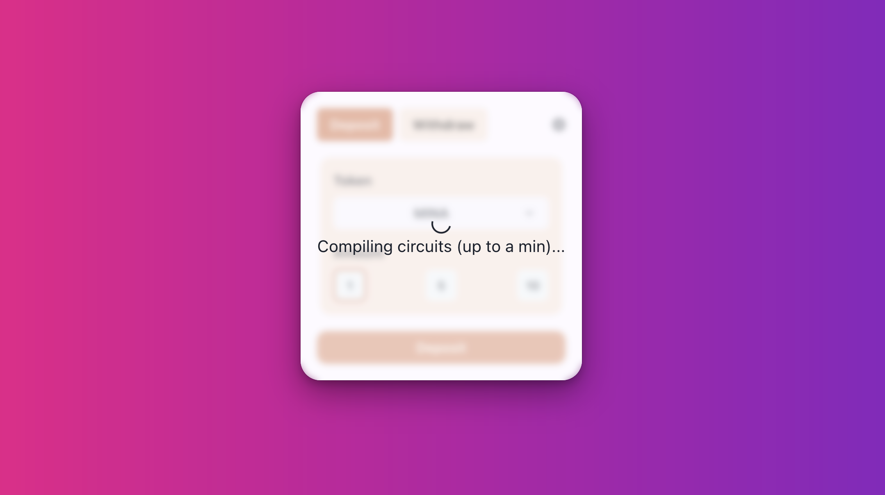
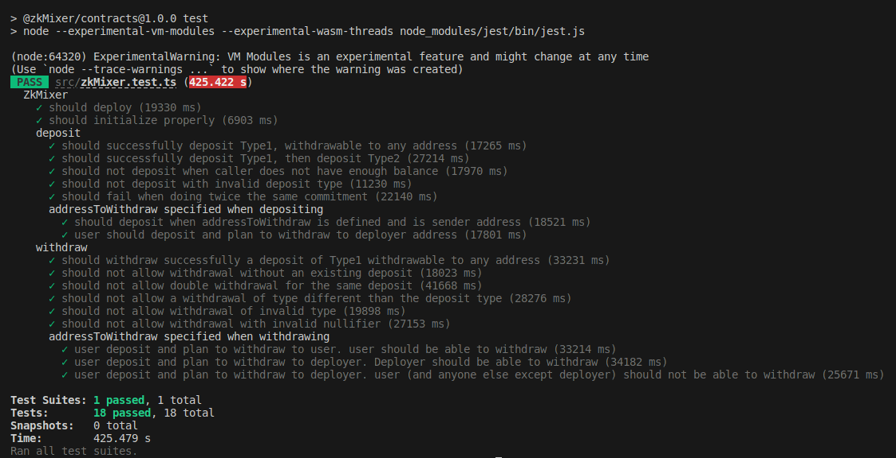
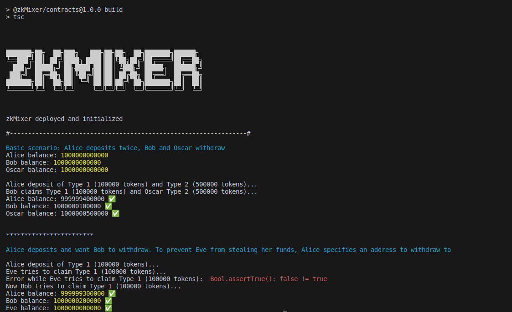

<a name="readme-top"></a>
[](https://github.com/julienbrs/Zk-ProofsMixer)

<!-- PROJECT LOGO -->
<br />
<div align="center" display="flex" flex-direction="row" justify-content="center" align-items="center">
  <a href="https://www.developerdao.com/fr">
    
  </a>
  <a href="https://minaprotocol.com/" style="margin-left: 20px">
    
  </a>
  </p>
</div>
<!-- TABLE OF CONTENTS -->
<summary>Table of Contents</summary>
<ol>
<li>
    <a href="#about-the-project">About The Project</a>
</li>
<li>
    <a href="#how-it-works">How It Works</a>
</li>
<li>
    <a href="#key-features">Key Features</a>
</li>
<li>
    <a href="#how-to-test">How to Test</a>
    <ul>
    <li><a href="#dapp">dApp</a></li>
    <li><a href="#local-installation">Local Installation</a></li>
    </ul>
</li>
<li>
    <a href="#more-to-come">More to Come</a>
</li>
<li>
    <a href="#license">License</a>
</li>
<li>
    <a href="#contributing">Contributing</a>
</li>
<li>
    <a href="#acknowledgements">Acknowledgements</a>
</li>
<li><a href="#contact">Contact</a></li>
</ol>
<br />
<!-- ABOUT THE PROJECT -->

## About The Project

ZkMixer is a project birthed from a hackathon organized by Developer DAO and Mina Protocol.

ZkMixer is a non-custodial Mina protocol and token privacy solution based on zkSNARKs, powered by SnarkyJS. This platform enhances transaction privacy by obliterating the on-chain link between sender and recipient addresses. The ZkMixer employs a smart contract that allows token deposits that can later be withdrawn by another address. Whenever tokens are withdrawn by the new address, it is impossible to trace the withdrawal back to the deposit, ensuring absolute privacy.

The concept of ZkMixer draws inspiration from the Tornado Cash project on Ethereum, but implements it within the Mina ecosystem, creating an opportunity for truly private transactions on the Mina blockchain.

The ZkMixer project has been extensively tested (you can run start running tests now because it takes 5 minutes to run it all, please see the [Getting Started](#how-to-test) section for more details), has been deployed on the Mina testnet. But we didn't have time to deploy the dApp on the mainnet.

<br />

<p align="center">
  
</p>
<p align="right">(<a href="#readme-top">back to top</a>)</p>

## How it works

To make a deposit, a user generates a secret (referred to as a 'commitment') and sends it, along with the deposit type, to the ZkMixer smart contract. The contract acknowledges the deposit and adds the commitment to its deposit tree, which is a Merkle Map (similar as a Merkle Tree but with key-value pairs instead of indices).

The deposit type indicates the quantity of tokens to deposit (1 for 100,000, 2 for 500,000, 3 for 1,000,000, be aware that it is not Mina tokens but the smallest unit of Mina currency). Once the deposit is made, the state of the Merkle tree is updated to include the new commitment.

Later, when the user decides to make a withdrawal, they need to provide a proof that they possess a secret to an unspent commitment from the smart contract’s deposit tree. zkSnark technology allows this to happen without revealing which exact deposit corresponds to this secret. The smart contract will check the proof and transfer the deposited tokens to the address specified for withdrawal. To an external observer, it will be impossible to determine which deposit this withdrawal originated from.

The typical use case of the contract is as follows: Alice deposits tokens into the contract, and Bob or Oscar withdraw the tokens. To prevent a malicious user (say, Eve) from withdrawing the funds before Bob or Oscar, Alice can specify a withdrawal address when she makes a deposit. This address can be that of Bob, Oscar, or even her own.

For the frontend, we utilize events to rebuild the entire Merkle tree. This might not be the most optimal situation due to its scalability limit; as the number of deposits grows, the process becomes increasingly slower. However, it allows each participant to have a complete Merkle tree, thus eliminating the need for off-chain storage and making the entire system 100% decentralized.

<p align="center">
  
  Recovering the Merkle tree from events
</p>
<p align="right">(<a href="#readme-top">back to top</a>)</p>

## Key Features

- Anonymity: ZkMixer employs zk-SNARKs (Zero-Knowledge Succinct Non-Interactive Argument of Knowledge) to ensure the privacy of transactions.
- Non-Custodial: ZkMixer does not hold custody of your tokens. You have full control of your assets.
- Fully Decentralized: ZkMixer is a decentralized application (dApp) that runs on the Mina blockchain without the need of off-chain storage.
- Open Source: The project is open source, so anyone can review, use or contribute to the project.

<!-- GETTING STARTED -->

## How to test

#### dApp

To test the dApp (website), you will need:

- A web3 wallet, such as [Auro Wallet](https://www.aurowallet.com/)
- A Mina account with some tokens

You can then test the dApp here: [Website](zkmixer.vercel.app)
We didn't have time to deploy.

### Local installation

If you want to test and run the dApp locally, you will need:

    Node.js
    Yarn or npm

- Clone the repo

```sh
git clone https://github.com/julienbrs/Zk-ProofsMixer.git
```

- Install package dependencies using yarn or npm

```sh
cd contracts && npm install
```

- Compile the contracts

```sh
npm run build
```

Run the tests (it might take approximately 5 minutes to run all the tests).

```sh
npm run test
```

<p align="center">
  
</p>

You can also run the integration tests to see some real use cases. If you want to see debug logs, please change `enable_logging` to `true` in `main.ts` at line 28 (do not forget to build again).

```sh
node build/src/main.js
```

<p align="right">(<a href="#readme-top">back to top</a>)</p>

<p align="center">
  
</p>

<!-- GOAL -->

</br>

### More to come

As we continue to refine ZkMixer, here are a few of the exciting features and improvements we are currently working on:

- Optimized Merkle Tree Reconstruction: We're thinking about innovative solutions to optimize the process of Merkle tree reconstruction, allowing for enhanced scalability while maintaining the decentralized nature of our platform.

- Extended Token Support: While ZkMixer currently supports Mina native token, we plan to extend our services to include custom token types.

- User Interface Enhancements: Improve the user experience, making the process of depositing and withdrawing as intuitive and smooth as possible. We also plan to add a dashboard to display the status of the Merkle tree and notifications for deposits and withdrawals.

- Comprehensive Creating more in-depth technical and user documentation to make it easier for everyone to understand and utilize ZkMixer.

- Community-driven Features: We understand the power of community and the value of their insights. We are open to suggestions and plan to integrate useful feature requests from users and developers.

We welcome all feedback and contributions to make ZkMixer the go-to privacy solution on the Mina protocol.

</br>

### Challenges and Difficulties

ZkMixer was our first foray into zk-SNARKs and the Mina protocol. Our journey started at ETH Tokyo, where inspiring dialogues with the Mina team led us to this hackathon. The learning curve was steep, and the majority of our time was devoted to understanding these complex concepts. Despite the short coding window of four days that we had, we were able to create a functional, though not yet complete, project.

Limitations in TypeScript caused deployment difficulties: we have to get the nonce and pass it as a `Field` with `nonce.toFields()`, however we didn't find a way to do it in a browser environment within the given timeframe.
Moreover, some parts of the UI remain unfinished (input field to specify a withdraw address is not implemented), but the project proved successful in local testing. This experience has been profoundly enriching, providing us with practical insights into the intricacies of zk-SNARKs and blockchain development.

### License

Distributed under the MIT License. See `LICENSE` for more information.

### Contributing

We welcome all contributions to the ZkMixer project. If you have any suggestions, please open an issue to discuss the changes you would like to make. You can also fork the repo and create a pull request with your changes, or contact us directly.

## Acknowledgements

We would like to express our deepest appreciation to Mina Protocol and Developer DAO for organizing this hackathon. Their initiatives like these offer significant opportunities for developers to learn, innovate, and contribute to the evolving blockchain space.

We'd like to extend our thanks to Mina for providing an environment that encourages development and exploration. Their comprehensive documentation and resources available on the [Mina Protocol website](https://minaprotocol.com/) and [Mina Protocol Documentation](https://docs.minaprotocol.com/) have been invaluable in the development process and have greatly facilitated our understanding of the protocol.

For those interested in diving deeper into the concepts of privacy and mixers, we highly recommend reading the documentation of [Aztec](https://docs.aztec.network/aztec/protocol/trees) and [Tornado Cash whitepaper](https://berkeley-defi.github.io/assets/material/Tornado%20Cash%20Whitepaper.pdf). These resources provide a wealth of information on privacy-focused solutions in the crypto space.

## Contact

<br />
Twitter:

- [Ainullindale](https://twitter.com/Ainullindale)
- [julio4](https://twitter.com/julio4__)

Mail: [zkMixerMina@gmail.com](mailto:zkMixerMina@gmail.com)
<br />

<p align="right">(<a href="#readme-top">back to top</a>)</p>
